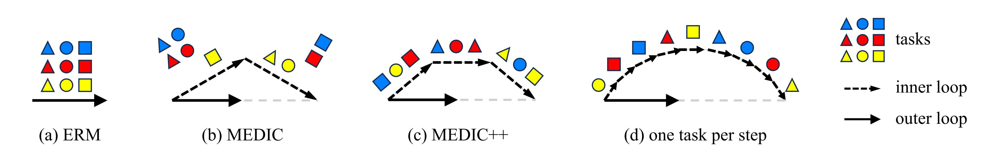

# MEDIC++

### 2025.10.31

1. Add the algorithm **Balanced Direction from Multifarious Choices: Arithmetic Meta-Learning for Domain Generalization** to the `v2` branch of our repository. You can set the `algorithm` in `config.py` to `arith` to enable it. We recommend using a smaller learning rate than MEDIC.
2. Remove the evaluation metric **H-score**, as we are still uncertain about its validity. However, you can still find it in our previous repository.
3. Refactor parts of the code and fix some bugs.

### 1. Introduction

This repository contains the implementation of the under-review paper **Exploring Dualistic Meta-Learning to Enhance Domain Generalization in Open Set Scenarios**, entended from our *ICCV 2023* paper **Generalizable Decision Boundaries: Dualistic Meta-Learning for Open Set Domain Generalization**.



### 2. Dataset Construction (Optional)

You can divide the dataset into two folders for training and validation. We provide reference code for automatically dividing data using official split in `data_list/split_kfold.py`.

```python
root_dir = "path/to/PACS"
instr_dir = "path/to/PACS_data_list"
```

### 3. Train

To run the training code, please update the path of the dataset in `main.py`:

```python
if dataset == 'PACS':	
    train_dir = 'path/to/PACS_train' # the folder of training data 
	val_dir = 'path/to/PACS_val' # the folder of validation data 
	test_dir = 'path/to/PACS_all' or ['path/to/PACS_train', 'path/to/PACS_val']
```

then simply run:

```
python main.py --source-domain ... --target-domain ... --save-name ... --gpu 0
```

If there is no validation folder, please use the option *--random-split* to create the validation set.

You can use *--save-later* to save the model in the last 15% iterations.

### 4. DomainBed

To simulate the DomainBed benchmark, please set transforms in `dataset/dataloader.py` as follows:

```python
if small_img == False:
        img_tr = [transforms.RandomResizedCrop((224, 224), (0.7, 1.0))] # 0.7 for DomainBed, otherwise 0.8
        
if color_jitter:
        img_tr.append(transforms.ColorJitter(brightness=0.3, contrast=0.3, saturation=0.3, hue=0.3)) # 0.3 for DomainBed, otherwise 0.4
```

then add options: 

+ *--batch-size 12 (18 for DomainNet, the total batch size is this value times the number of tasks 9)*
+ *--optimize-method Adam*
+ *--num-epoch 5100 (15000 for DomainNet)*
+ *--eval-step 300*
+ *--lr 6e-6 (divide the default learning rate 5e-5 by the number of tasks 9)*
+ *--without-bcls*

```
python main.py --source-domain ... --target-domain ... --save-name ... --gpu 0 --batch-size 12 --optimize-method Adam --num-epoch 5100 --eval-step 300 --lr 6e-6 --without-bcls
```

### 5. Evalution

To run the evaluation code, please update the path of the dataset in `eval.py`:

```python
if dataset == 'PACS':
        root_dir = 'path/to/PACS_all' or ['path/to/PACS_train', 'path/to/PACS_val']
```

then simply run:

```
python eval.py --hits ... --save-name ... --gpu 0
```

+ *--hits (check points for H-score)*
